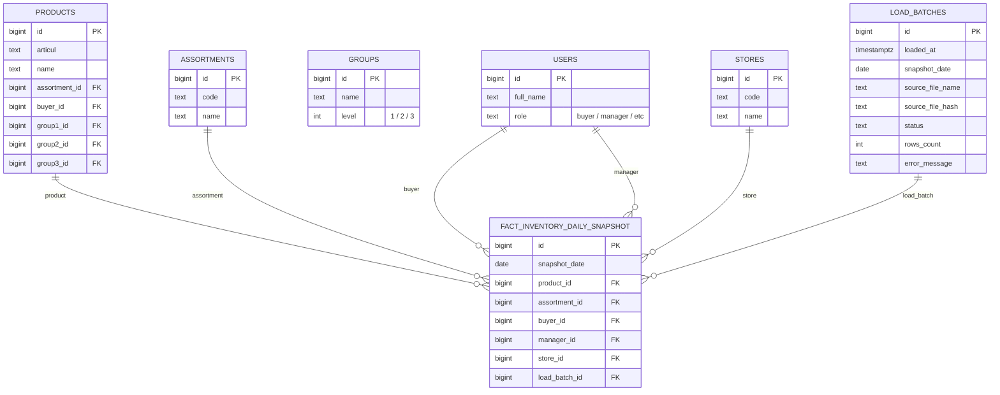

## ER-диаграмма данных

```mermaid
erDiagram

    %% OLTP (service layer)

    USERS {
        bigint id PK
        text  full_name
        text  role        "buyer / manager / etc"
    }

    ASSORTMENTS {
        bigint id PK
        text  code
        text  name
    }

    GROUPS {
        bigint id PK
        text  name
        int   level      "1 / 2 / 3"
    }

    STORES {
        bigint id PK
        text  code
        text  name
    }

    PRODUCTS {
        bigint id PK
        text  articul
        text  name
        bigint assortment_id FK
        bigint buyer_id      FK
        bigint group1_id     FK
        bigint group2_id     FK
        bigint group3_id     FK
    }

    LOAD_BATCHES {
        bigint id PK
        timestamptz loaded_at
        date        snapshot_date
        text        source_file_name
        text        source_file_hash
        text        status
        int         rows_count
        text        error_message
    }

    FACT_INVENTORY_DAILY_SNAPSHOT {
        bigint id PK
        date   snapshot_date
        bigint product_id    FK
        bigint assortment_id FK
        bigint buyer_id      FK
        bigint manager_id    FK
        bigint store_id      FK
        bigint load_batch_id FK
    }

    PRODUCTS    ||--o{ FACT_INVENTORY_DAILY_SNAPSHOT : "product"
    ASSORTMENTS ||--o{ FACT_INVENTORY_DAILY_SNAPSHOT : "assortment"
    USERS       ||--o{ FACT_INVENTORY_DAILY_SNAPSHOT : "buyer"
    USERS       ||--o{ FACT_INVENTORY_DAILY_SNAPSHOT : "manager"
    STORES      ||--o{ FACT_INVENTORY_DAILY_SNAPSHOT : "store"
    LOAD_BATCHES||--o{ FACT_INVENTORY_DAILY_SNAPSHOT : "load_batch"
```